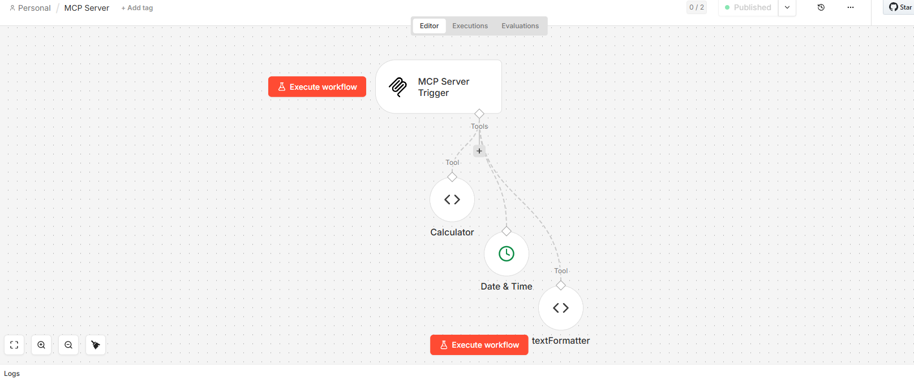
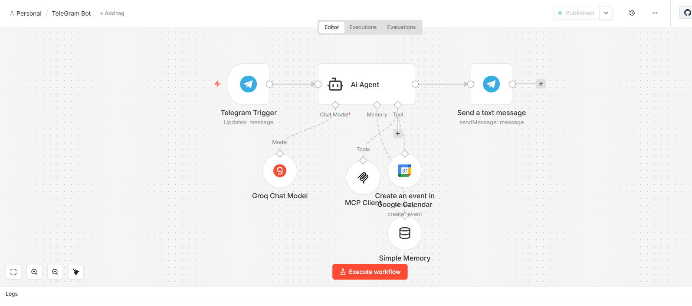
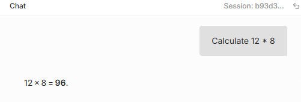
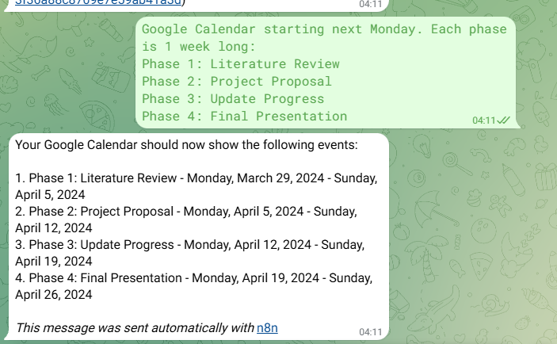

# NLP Assignment 7: Telegram Bot with MCP Server & AI Integration

A sophisticated NLP project combining a Telegram bot with MCP (Model Context Protocol) server integration, powered by Groq AI and Google Calendar API.

## 📋 Project Overview

This project demonstrates advanced NLP and automation capabilities by creating an intelligent Telegram bot that can:
- Process natural language queries
- Perform calculations
- Manage Google Calendar events
- Format text with AI assistance
- Maintain conversation memory

---

## 🏗️ Architecture

### MCP Server with Tools
The backbone of our system is an MCP Server that provides multiple tools:



This diagram shows:
- **MCP Server Trigger** - The entry point for all requests
- **Calculator Tool** - For mathematical computations
- **Date & Time Tool** - For date and time operations
- **Text Formatter Tool** - For text formatting tasks

### Telegram Bot Workflow
The Telegram bot integrates everything together with AI intelligence:



Key components:
- **Telegram Trigger** - Receives messages from users
- **AI Agent** powered by Groq Chat Model
- **MCP Client** - Calls our MCP Server tools
- **Google Calendar Integration** - Creates events automatically
- **Simple Memory** - Maintains conversation context
- **Message Response** - Sends answers back to Telegram

---

## 🎯 Features in Action

### Feature 1: Smart Calculations
The bot can perform calculations and provide immediate results:



Example interaction:
- User: "Calculate 12 * 8"
- Bot: "12 × 8 = 96."

### Feature 2: Calendar Event Scheduling
The bot can intelligently create Google Calendar events from natural language:



The bot automatically:
1. Parses event descriptions from messages
2. Creates calendar entries with proper dates and times
3. Sends confirmation messages back to the user
4. Supports multi-day or weekly event scheduling

---

## 🛠️ Technology Stack

- **Language Model**: Groq AI
- **Messaging Platform**: Telegram Bot API
- **Automation Platform**: n8n
- **Calendar Integration**: Google Calendar API
- **Protocol**: Model Context Protocol (MCP)
- **Deployment**: Docker & Docker Compose

---

## 🚀 Getting Started

### Prerequisites
- Docker & Docker Compose
- Telegram Bot Token
- Google Calendar API credentials
- Groq API key

### Installation

1. Clone the repository:
```bash
git clone <repository-url>
cd NLP_A7
```

2. Set up environment variables in `.env`:
```bash
TELEGRAM_BOT_TOKEN=your_token
GROQ_API_KEY=your_key
GOOGLE_CALENDAR_CREDENTIALS=your_credentials.json
```

3. Deploy with Docker:
```bash
docker-compose up -d
```

---

## 📁 Project Structure

```
.
├── docker-compose.yml           # Docker configuration
├── README.md                    # This file
├── modelAnswer.png              # Calculator demo screenshot
├── serverbot.png                # MCP Server architecture diagram
├── teleGramBot.png              # Complete bot workflow diagram
├── telegramanswer.png           # Calendar event scheduling demo
```

---

## 🔄 Workflow Summary

1. **User sends message to Telegram bot**
2. **n8n processes the message** via Telegram Trigger
3. **AI Agent (Groq)** analyzes the intent and generates a response
4. **MCP Client** calls appropriate tools if needed:
   - Calculator for math
   - Date & Time for scheduling
   - Text Formatter for text processing
5. **Google Calendar** is updated if needed
6. **Bot responds** with the result back to Telegram

---

## 🎓 Learning Outcomes

This project demonstrates:
- Integration of multiple APIs and services
- Use of modern LLMs (Groq) for NLP tasks
- Workflow automation with n8n
- MCP protocol implementation
- Stateful conversation management
- Real-world NLP application

---

## 📝 Notes

- All credentials should be stored in `.env` file
- The MCP Server runs as a separate service
- Messages are processed with full context awareness
- Calendar events are created in UTC timezone

---

## 👤 Author

NLP Assignment 7 - AIT